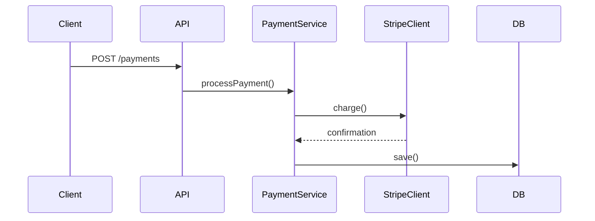
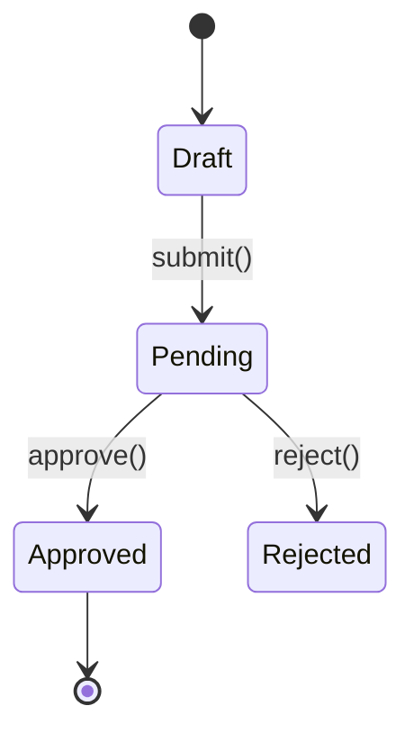

# Create Pull Request

Draft a concise and descriptive title and a short paragraph for a PR. Explain the purpose of the changes, the problem they solve, and the general approach taken. When the changes involve clear runtime flows or state transitions, include Mermaid diagrams.

## Step 1: Analyze Changes

If git is in a feature branch, examine all commit messages and the full diff to understand the overall changes. Analyze the diff for diagram opportunities (see Diagrams section below).

## Step 2: Draft Title and Description

Run `/github-voice` to load writing style rules before drafting.

Draft a title and description, embedding any diagrams in the body. Output the drafted title and description as chat text so the user can review it.

## Step 3: Confirm and Create

Use `AskUserQuestion` for confirmation only. Write the drafted body to `.turbo/pr/body.md` with the Write tool, then create the PR with `gh pr create --body-file`:

```bash
gh pr create --title "<TITLE>" --body-file .turbo/pr/body.md
```

Do not set `--assignee` unless the user explicitly asks to assign someone.

## Diagrams

GitHub renders Mermaid natively in PR descriptions via ` ```mermaid ` code blocks. Include diagrams only when they add clarity a text description can't — skip for trivial changes or obvious flows.

### Sequence Diagram

Include when the changes introduce or modify a clear runtime flow: API endpoints, event handlers, pipelines, multi-service interactions, webhook flows.

````markdown

````

### State Diagram

Include when the changes add or modify entity states, status enums, workflow transitions, or lifecycle hooks.

````markdown

````

### Rules

- Only include when the diagram genuinely adds clarity
- Keep diagrams focused — max ~10 nodes/transitions
- Use descriptive labels on arrows (method names, HTTP verbs)
- Place diagrams after the summary paragraph under a `## Flow` or `## State Machine` heading
- One diagram per type max — don't include both unless the PR truly has both patterns

## Rules

- Don't reference `.turbo/` content (filenames, requirement IDs, shell references, headings) in the title or body. `.turbo/` is gitignored, so these references would be opaque to anyone reading without local copies.
